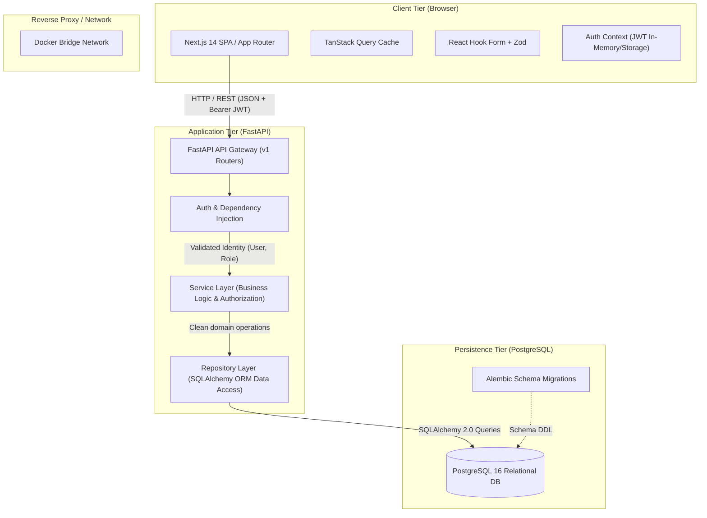
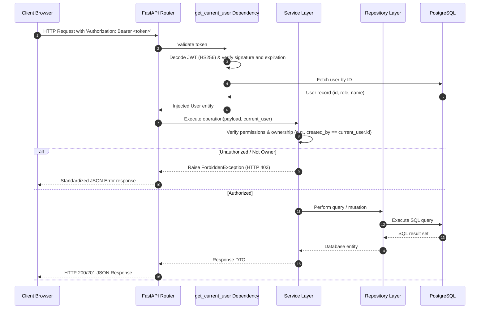
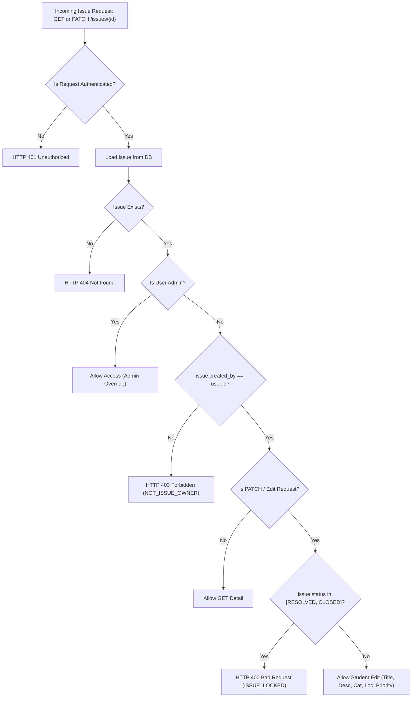

# Architecture Overview - Campus Issue Tracker

## 1. System Architecture

The Campus Issue Tracker is designed as a decoupled, modern multi-tier web application built with separation of concerns, strict type safety, server-enforced role-based access control (RBAC), and persistent relational storage.

---

## 2. Frontend Architecture

The frontend is implemented using **Next.js (App Router)** with **TypeScript** and **Tailwind CSS**.

### Key Architectural Layers:
1. **Routing & Pages (`app/`)**:
   - `(public)` routes: `/login`, `/register`
   - `(student)` routes: `/dashboard`, `/issues`, `/issues/new`, `/issues/[id]`
   - `(admin)` routes: `/admin`, `/admin/issues`, `/admin/issues/[id]`
2. **State & Caching (`TanStack Query`)**:
   - Manages asynchronous server state, cache invalidation, and background refreshing.
   - Decouples UI rendering from fetch lifecycles.
3. **Authentication Layer (`lib/auth.tsx`)**:
   - Manages active JWT tokens, user profiles, login/logout transitions, and client-side route guard redirection.
4. **Form Handling & Validation (`React Hook Form` + `Zod`)**:
   - Schema validation with Zod enforces real-time client-side feedback matching the backend constraints.
5. **Component Design System (`components/`)**:
   - Atomic and composite components: Button, Input, Select, Badge, Card, Modal, StatusTimeline, FilterControls, StatsCards.

---

## 3. Backend Architecture: Clean Layered Design

The backend enforces a strict **Layered Clean Architecture** pattern to guarantee testability, maintainability, and loose coupling.

```mermaid
flowchart LR
    subgraph Presentation["1. Presentation Layer"]
        Router["FastAPI Routers (/api/v1/*)"]
        Schemas["Pydantic v2 Schemas"]
        ExceptionHandler["Global Exception Handler"]
    end

    subgraph Business["2. Business Logic Layer"]
        AuthSvc["AuthService"]
        IssueSvc["IssueService"]
        CommentSvc["CommentService"]
        AdminSvc["AdminService"]
        TeamSvc["TeamService"]
    end

    subgraph DataAccess["3. Data Access Layer"]
        UserRepo["UserRepository"]
        IssueRepo["IssueRepository"]
        CommentRepo["CommentRepository"]
        TeamRepo["TeamRepository"]
    end

    subgraph Persistence["4. Database Engine"]
        SQLA["SQLAlchemy 2.0 Engine"]
        Postgres["PostgreSQL / SQLite"]
    end

    Router --> Schemas
    Router --> Business
    Business --> DataAccess
    DataAccess --> SQLA
    SQLA --> Postgres
    ExceptionHandler -.->|"Catches Domain Exceptions"| Router
```

### Layer Responsibilities:
- **API Routers (`app/api/v1/`)**: Pure transport protocol handling (HTTP headers, query params, status codes). No business logic.
- **Service Layer (`app/services/`)**: Core application rules, lifecycle transitions, authorization verification, domain checks.
- **Repository Layer (`app/repositories/`)**: Encapsulates SQLAlchemy queries, filtering logic, eager loading (`joinedload`), joins, and aggregations.
- **Models (`app/models/`)**: Declarative database schema definitions with relational constraints and cascade policies.

---

## 4. Request Lifecycle & Authorization

Every authenticated request follows a rigorous verification pipeline before reaching database operations:

---

## 5. Issue Ownership & Authorization Decision Flowchart

