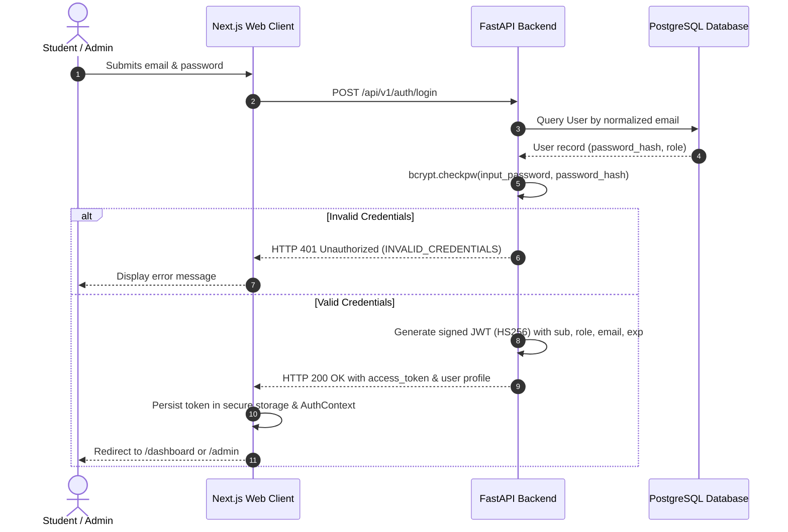

# Authentication & Authorization Model - Campus Issue Tracker

## 1. Authentication Architecture

The system utilizes JSON Web Tokens (JWT) for stateless, secure authentication combined with adaptive password hashing using **Bcrypt**.

---

## 2. Token Specification

- **Algorithm**: `HS256` (HMAC with SHA-256)
- **Token Claims**:
  - `sub`: User UUID string
  - `email`: Normalized email string
  - `role`: `STUDENT` or `ADMIN`
  - `name`: User's full name
  - `iat`: Issued at timestamp (UTC)
  - `exp`: Expiration timestamp (default 24 hours)

---

## 3. Role-Based Access Control (RBAC) Matrix

| Endpoint | Action | Student | Admin | Ownership Check |
|---|---|:---:|:---:|:---:|
| `POST /auth/register` | Register account | Public | Public | N/A |
| `POST /auth/login` | Authenticate | Public | Public | N/A |
| `GET /auth/me` | Fetch profile | Allowed | Allowed | N/A |
| `POST /issues` | Create new issue | Allowed | Allowed | N/A |
| `GET /issues` | List issues | Scoped to own | All issues | Enforced server-side |
| `GET /issues/{id}` | View issue details | Own issue only | Any issue | HTTP 403 if not owner |
| `PATCH /issues/{id}` | Edit issue content | Own issue only (if open) | Any issue | HTTP 403 if not owner; HTTP 400 if resolved |
| `GET /issues/{id}/comments` | Read comments | Own issue only | Any issue | HTTP 403 if not owner |
| `POST /issues/{id}/comments`| Post comment | Own issue only | Any issue | HTTP 403 if not owner |
| `PATCH /admin/issues/{id}/status` | Update status | Denied (403) | Allowed | Role check |
| `PATCH /admin/issues/{id}/priority` | Update priority | Denied (403) | Allowed | Role check |
| `PATCH /admin/issues/{id}/assignment` | Assign staff/team | Denied (403) | Allowed | Role check |
| `GET /admin/stats` | Admin metrics | Denied (403) | Allowed | Role check |
| `GET /admin/staff` | List staff | Denied (403) | Allowed | Role check |
| `POST /teams` | Create team | Denied (403) | Allowed | Role check |

---

## 4. Ownership Protection Guarantees

1. **Server-Side Enforcement**: The backend never trusts the client's role or claims without verification. The user ID is extracted from the cryptographically verified JWT.
2. **Strict Scoping**: When a student calls `GET /api/v1/issues`, the query is automatically scoped with `WHERE created_by = current_user.id`. A student cannot bypass this via query parameters.
3. **Explicit Cross-Student Prohibition**: When a student directly accesses `/api/v1/issues/{id}` or adds a comment to an issue that was created by another student, the service layer rejects the request with `HTTP 403 Forbidden` (`NOT_ISSUE_OWNER`).
4. **Resolved Issue Lock**: Once an issue has reached `RESOLVED` or `CLOSED`, students cannot alter its content, preventing post-resolution falsification (`HTTP 400 Bad Request: ISSUE_LOCKED`).
