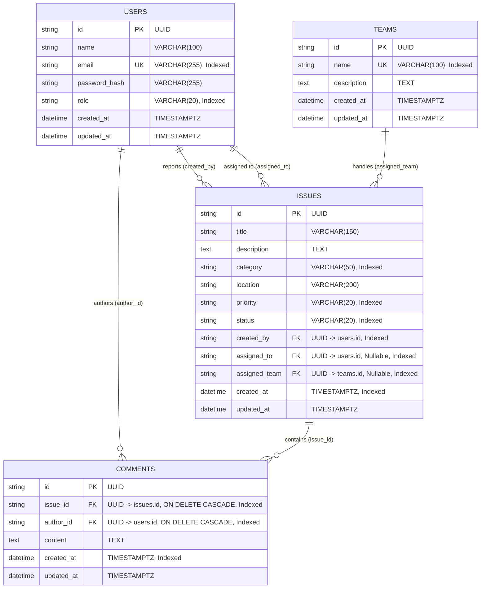

# Database Architecture - Campus Issue Tracker

## 1. Overview

The database is built on **PostgreSQL** using **SQLAlchemy 2.0** and managed with **Alembic** migrations.
It adheres to third normal form (3NF) with explicit foreign key constraints, cascading policies, and optimized indexing for fast search and filtering.

---

## 2. Entity Relationship Diagram (ERD)



---

## 3. Tables & Indexing Strategy

### 3.1 `users`
- **Primary Key**: `id` (UUID v4).
- **Indexes**:
  - `ix_users_email` (`UNIQUE`): Ensures uniqueness and rapid user lookup during authentication.
  - `ix_users_role`: Speeds up staff and student role filtering.

### 3.2 `teams`
- **Primary Key**: `id` (UUID v4).
- **Indexes**:
  - `ix_teams_name` (`UNIQUE`): Prevents duplicate department team names.

### 3.3 `issues`
- **Primary Key**: `id` (UUID v4).
- **Indexes**:
  - `ix_issues_created_by`: Fast lookup of issues owned by a student.
  - `ix_issues_status`: Filtering by lifecycle state (`OPEN`, `IN_PROGRESS`, etc.).
  - `ix_issues_category`: Filtering by campus domain category.
  - `ix_issues_priority`: Filtering by urgency level.
  - `ix_issues_created_at`: Sorting newest issues first without full table scans.
  - `ix_issues_assigned_to` & `ix_issues_assigned_team`: Quick filtering for administrative routing.
- **Foreign Keys**:
  - `created_by` references `users(id)` ON DELETE CASCADE.
  - `assigned_to` references `users(id)` ON DELETE SET NULL.
  - `assigned_team` references `teams(id)` ON DELETE SET NULL.

### 3.4 `comments`
- **Primary Key**: `id` (UUID v4).
- **Indexes**:
  - `ix_comments_issue_id`: Fast retrieval of comment threads for a specific issue.
  - `ix_comments_author_id`: Lookup of user comments.
  - `ix_comments_created_at`: Chronological timeline ordering.
- **Foreign Keys**:
  - `issue_id` references `issues(id)` ON DELETE CASCADE.
  - `author_id` references `users(id)` ON DELETE CASCADE.

---

## 4. Migrations

All database modifications are tracked via **Alembic**.
To run migrations from scratch:
```bash
alembic upgrade head
```
To generate a new schema revision:
```bash
alembic revision --autogenerate -m "describe_changes"
```
